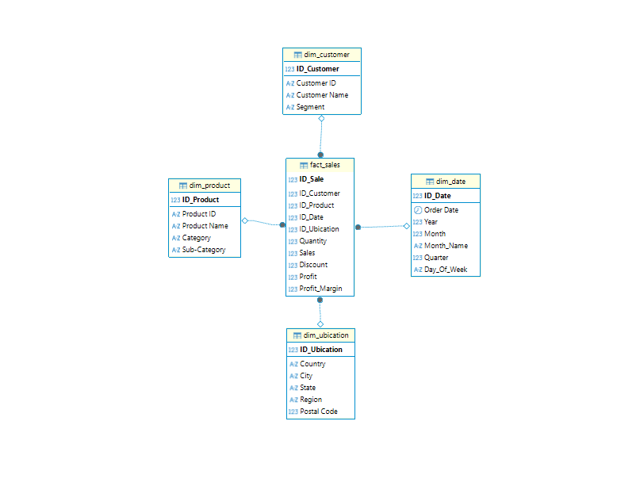
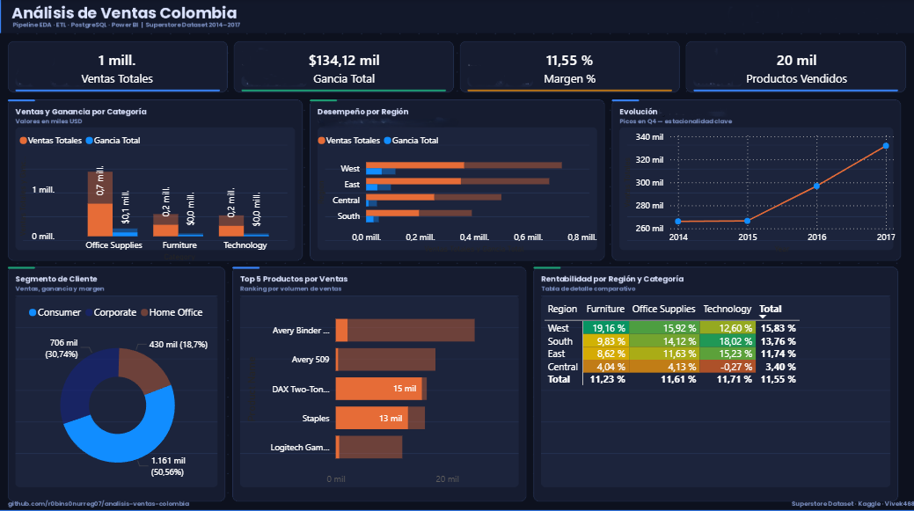

# Analisis de Ventas - Superstore Dataset

Pipeline de datos end-to-end: EDA, ETL con Python, modelo estrella en PostgreSQL y dashboard en Power BI.

## Descripcion general

Proyecto de analitica de datos que cubre el flujo desde la exploracion del dataset hasta la preparacion para visualizacion interactiva. Incluye:

- Exploracion de datos (EDA)
- Limpieza y transformacion (ETL)
- Modelado en estrella en PostgreSQL
- Preparacion para dashboard en Power BI Desktop
- Carga de datos desde notebooks a PostgreSQL con SQLAlchemy

## Objetivo del proyecto

Construir un pipeline de datos completo que permita responder preguntas clave del negocio sobre ventas, utilizando buenas practicas de ingenieria de datos y analitica.

### Preguntas de negocio principales

- Cual es el ingreso total y el margen de ganancia?
- Que categoria de productos genera mas ingresos y cual mas perdidas?
- En que region se vende mas y donde es mas rentable operar?
- Cual es la evolucion mensual de las ventas?
- Que segmento de cliente genera mas valor?

## Dataset

| Campo | Detalle |
|---|---|
| Nombre | Superstore Sales Dataset |
| Fuente | Kaggle - Vivek468 |
| Archivo original | `data/raw/Sample_Superstore.csv` |
| Archivo limpio | `data/clean/Sample_Superstore_clean.csv` |
| Filas | 9,994 transacciones |
| Columnas originales | 21 |
| Columnas limpias | 22 |
| Periodo | 2014-01-03 a 2017-12-30 |
| Formato | CSV |
| Link | https://www.kaggle.com/datasets/vivek468/superstore-dataset-final |

## Tecnologias utilizadas

- Python
- pandas
- numpy
- matplotlib
- seaborn
- SQLAlchemy
- python-dotenv
- ipykernel
- PostgreSQL
- DBeaver
- Power BI
- Jupyter Notebook
- uv

## Estructura del repositorio

```text
analisis-ventas-colombia/
|-- assets/
|   |-- Dashboard.png
|   `-- star_model.png
|-- data/
|   |-- raw/
|   |   `-- Sample_Superstore.csv
|   `-- clean/
|       `-- Sample_Superstore_clean.csv
|-- notebook/
|   |-- EDA.ipynb
|   `-- ETL.ipynb
|-- powerbi/
|-- sql/
|   `-- relate_table.sql
|-- .env.example
|-- main.py
|-- pyproject.toml
|-- uv.lock
`-- README.md
```

## Arquitectura del proyecto

```text
[CSV raw] -> [notebook/EDA.ipynb] -> [notebook/ETL.ipynb] -> [PostgreSQL + DBeaver] -> [Power BI]
```

- EDA: exploracion y deteccion de problemas.
- ETL: limpieza, transformacion y carga.
- PostgreSQL: modelo estrella para analisis.
- DBeaver: administracion, consulta y validacion de la base de datos.
- Power BI: visualizacion e insights.

## Assets del proyecto

### Modelo estrella



### Dashboard



## Flujo de trabajo

1. Carga del archivo original desde `data/raw/Sample_Superstore.csv`.
2. Analisis exploratorio en `notebook/EDA.ipynb`.
3. Validacion de nulos, duplicados, tipos de datos y distribuciones.
4. Transformacion de fechas y creacion de `Profit Margin`.
5. Generacion del archivo limpio en `data/clean/Sample_Superstore_clean.csv`.
6. Creacion de dimensiones y tabla de hechos en `notebook/ETL.ipynb`.
7. Relacionamiento de tablas en PostgreSQL con `sql/relate_table.sql`.
8. Construccion del dashboard en Power BI.

## Modelo estrella

El modelo se organiza alrededor de la tabla de hechos `fact_sales`, conectada con dimensiones de cliente, producto, ubicacion y fecha.

```text
                  dim_customer
                       |
                       |
dim_product ---- fact_sales ---- dim_date
                       |
                       |
                 dim_ubication
```

### Tabla de hechos: `fact_sales`

| Columna | Descripcion |
|---|---|
| `ID_Sale` | Identificador de la venta |
| `ID_Customer` | Llave hacia `dim_customer` |
| `ID_Product` | Llave hacia `dim_product` |
| `ID_Date` | Llave hacia `dim_date` |
| `ID_Ubication` | Llave hacia `dim_ubication` |
| `Quantity` | Cantidad vendida |
| `Sales` | Valor de venta |
| `Discount` | Descuento aplicado |
| `Profit` | Ganancia |
| `Profit_Margin` | Margen de ganancia |

### Dimensiones

| Dimension | Campos principales | Registros |
|---|---|---:|
| `dim_customer` | Customer ID, Customer Name, Segment | 793 |
| `dim_product` | Product ID, Product Name, Category, Sub-Category | 1,894 |
| `dim_ubication` | Country, City, State, Region, Postal Code | 632 |
| `dim_date` | Order Date, Year, Month, Month Name, Quarter, Day Of Week | 1,237 |

## Instalacion y configuracion

1. Clonar el repositorio.

```bash
git clone https://github.com/r0bins0nurreg07/analisis-ventas-colombia.git
cd analisis-ventas-colombia
```

2. Crear y activar el entorno virtual.

```powershell
python -m venv .venv
.\.venv\Scripts\Activate.ps1
```

3. Instalar dependencias.

```powershell
uv sync
```

Tambien se puede instalar manualmente con `pip` usando las dependencias declaradas en `pyproject.toml`.

4. Crear el archivo `.env` a partir de `.env.example`.

```env
DB_USER=tu_usuario
DB_PASSWORD=tu_password
DB_HOST=localhost
DB_PORT=5432
DB_NAME=ventas_db
```

5. Crear la base de datos en PostgreSQL.

```sql
CREATE DATABASE ventas_db;
```

## Como correr el proyecto

1. Activar el entorno virtual.

```powershell
.\.venv\Scripts\Activate.ps1
```

2. Instalar o sincronizar las dependencias.

```powershell
uv sync
```

3. Configurar las variables de entorno en `.env`.

```env
DB_USER=tu_usuario
DB_PASSWORD=tu_password
DB_HOST=localhost
DB_PORT=5432
DB_NAME=ventas_db
```

4. Crear la base de datos en PostgreSQL si todavia no existe.

```sql
CREATE DATABASE ventas_db;
```

5. Ejecutar los notebooks en orden.

```text
notebook/EDA.ipynb
notebook/ETL.ipynb
```

6. Ejecutar el script principal para aplicar el relacionamiento de tablas en PostgreSQL.

```powershell
python main.py
```

7. Validar las tablas y relaciones en DBeaver.

```text
Motor: PostgreSQL
Base de datos: ventas_db
Tablas: dim_customer, dim_product, dim_ubication, dim_date, fact_sales
```

8. Abrir Power BI y conectar el reporte a PostgreSQL.

```text
Origen: PostgreSQL
Servidor: localhost
Base de datos: ventas_db
```

> Nota: este proyecto usa `PostgreSQL` como motor relacional, `DBeaver` para administrar y validar la base de datos, y `Power BI` como destino de visualizacion. El notebook `ETL.ipynb` construye las dimensiones y la tabla de hechos, y `main.py` carga esos datos a la base de datos.

## Analisis exploratorio

El EDA valido la calidad inicial del dataset y permitio identificar patrones de ventas y rentabilidad.

### Validaciones realizadas

- Revision de estructura, tipos de datos y dimensiones del dataset.
- Conteo de valores nulos.
- Busqueda de cadenas vacias en columnas de texto.
- Deteccion de filas duplicadas.
- Estadisticas descriptivas.
- Distribucion de ventas y ganancias.
- Analisis por categoria, region, producto, segmento y tiempo.

### Hallazgos principales

- El dataset limpio contiene 9,994 registros y no presenta nulos ni duplicados.
- Las ventas totales son `2,297,200.86`.
- La ganancia total es `286,397.02`.
- El margen global ponderado es `12.47%`.
- La mayor perdida por transaccion es `-6,599.98`.
- La mayor ganancia por transaccion es `8,399.98`.
- Technology es la categoria con mayores ventas y mayor ganancia.
- Furniture tiene ventas altas, pero rentabilidad mucho menor que las demas categorias.
- West y East son las regiones con mejor desempeno en ventas y ganancias.
- Consumer es el segmento con mayor venta total.
- Home Office tiene el mejor margen porcentual entre segmentos.

## Resultados por categoria

| Categoria | Ventas | Ganancia |
|---|---:|---:|
| Technology | 836,154.03 | 145,454.95 |
| Furniture | 741,999.80 | 18,451.27 |
| Office Supplies | 719,047.03 | 122,490.80 |

## Resultados por region

| Region | Ventas | Ganancia |
|---|---:|---:|
| West | 725,457.82 | 108,418.45 |
| East | 678,781.24 | 91,522.78 |
| Central | 501,239.89 | 39,706.36 |
| South | 391,721.91 | 46,749.43 |

## Resultados por segmento

| Segmento | Ventas | Ganancia | Margen |
|---|---:|---:|---:|
| Consumer | 1,161,401.34 | 134,119.21 | 11.55% |
| Corporate | 706,146.37 | 91,979.13 | 13.03% |
| Home Office | 429,653.15 | 60,298.68 | 14.03% |

## Top productos por ventas

| Producto | Ventas |
|---|---:|
| Canon imageCLASS 2200 Advanced Copier | 61,599.82 |
| Fellowes PB500 Electric Punch Plastic Comb Binding Machine with Manual Bind | 27,453.38 |
| Cisco TelePresence System EX90 Videoconferencing Unit | 22,638.48 |
| HON 5400 Series Task Chairs for Big and Tall | 21,870.58 |
| GBC DocuBind TL300 Electric Binding System | 19,823.48 |

## ETL

El proceso de ETL transforma el dataset original en un archivo limpio y en tablas listas para analisis.

| Paso | Accion | Resultado |
|---|---|---|
| Carga | Lectura del CSV original | Dataset base disponible en pandas |
| Limpieza | Validacion de nulos, duplicados y textos vacios | Dataset sin problemas criticos de calidad |
| Fechas | Conversion de `Order Date` y `Ship Date` a formato fecha | Campos listos para analisis temporal |
| Metricas | Creacion de `Profit Margin` | Nueva columna de rentabilidad |
| Dimensiones | Separacion de cliente, producto, ubicacion y fecha | Modelo dimensional construido |
| Hechos | Creacion de `fact_sales` | Tabla central de ventas |
| Salida | Exportacion a `data/clean/Sample_Superstore_clean.csv` | Dataset limpio guardado |
| Base de datos | Relacionamiento con llaves primarias y foraneas | Modelo estrella conectado en PostgreSQL |

## Dashboard Powe

El dashboard fue construido en Power BI a partir del modelo estrella cargado en PostgreSQL y validado desde DBeaver.


Visualizaciones recomendadas:

- Tarjetas de ventas totales, ganancia total y margen.
- Grafico de ventas por mes.
- Grafico de ventas y ganancias por categoria.
- Grafico de ventas y ganancias por region.
- Analisis por segmento de cliente.
- Ranking de productos por ventas.
- Filtros por fecha, categoria, region y segmento.

## Conclusiones

- El negocio es rentable a nivel global, con un margen ponderado de `12.47%`.
- Technology es la linea mas fuerte porque lidera tanto en ventas como en utilidad.
- Furniture requiere revision, ya que vende mucho pero aporta poca ganancia frente a las demas categorias.
- West y East concentran el mejor desempeno comercial.
- Consumer aporta el mayor volumen de ventas, pero Home Office muestra el mejor margen.
- Los picos de ventas al final del ano sugieren una estacionalidad importante para planear inventario, campanas y metas comerciales.

## Recomendaciones de negocio

- Revisar descuentos, costos y politicas comerciales de Furniture para mejorar rentabilidad.
- Priorizar estrategias de crecimiento sobre Technology por su alta contribucion a ventas y utilidad.
- Replicar buenas practicas de West y East en regiones con menor desempeno.
- Crear acciones comerciales diferenciadas por segmento: volumen para Consumer y rentabilidad para Home Office.
- Monitorear productos con perdidas altas para detectar descuentos excesivos o problemas de margen.

## Estado actual del proyecto

El proyecto esta completado. El proceso de datos fue desarrollado en Python, el modelo estrella fue cargado en PostgreSQL y validado con DBeaver, y el dashboard final fue construido en Power BI.

- EDA completado.
- Dataset limpio generado.
- ETL desarrollado.
- Modelo estrella construido.
- Script SQL de relaciones creado.
- Conexion y variables de entorno configuradas para PostgreSQL.
- Base de datos administrada y validada en DBeaver.
- Dashboard construido en Power BI y documentado en el README.

## Autor

Robinson Urrego

- GitHub: https://github.com/r0bins0nurreg07
- LinkedIn:www.linkedin.com/in/robinson-urrego


## Licencia

Este proyecto es de uso educativo y libre distribucion.

Dataset original: Superstore Sales Dataset, disponible en Kaggle.
